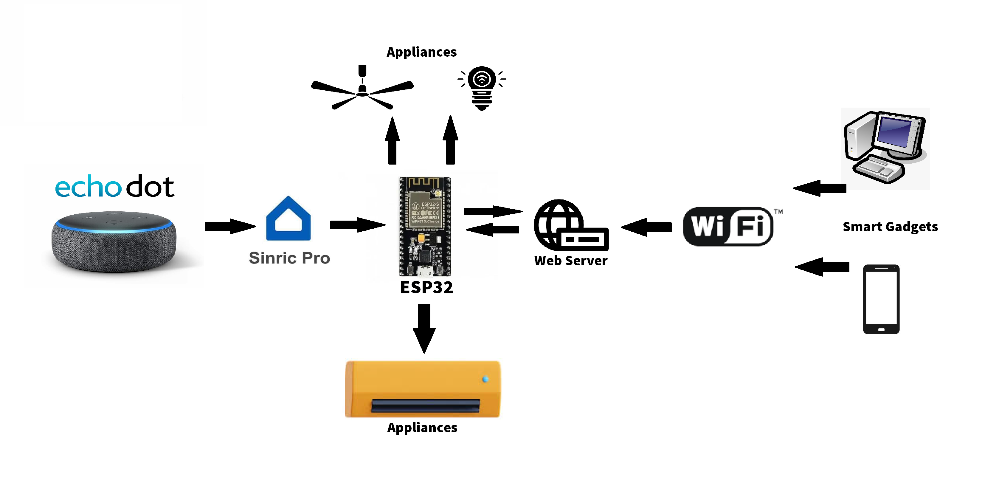
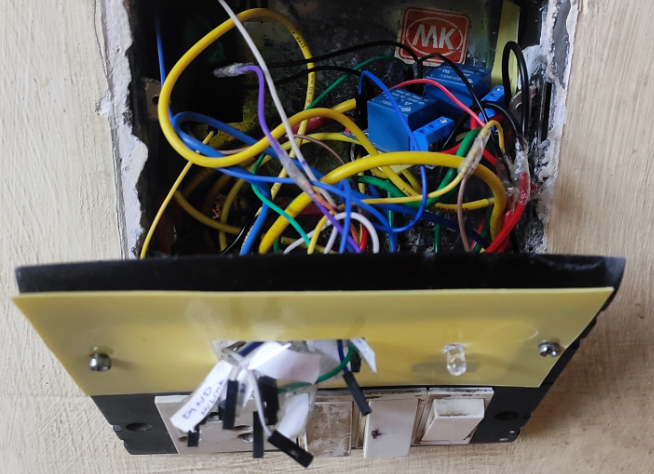
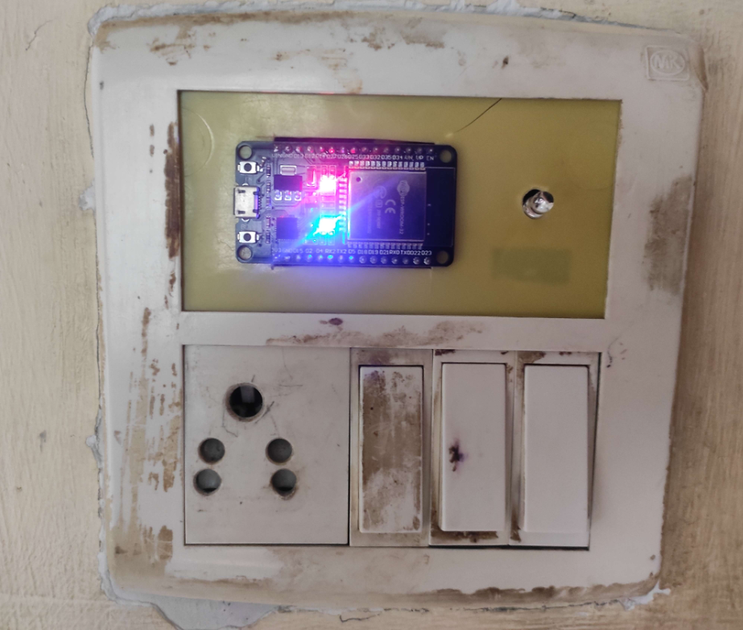
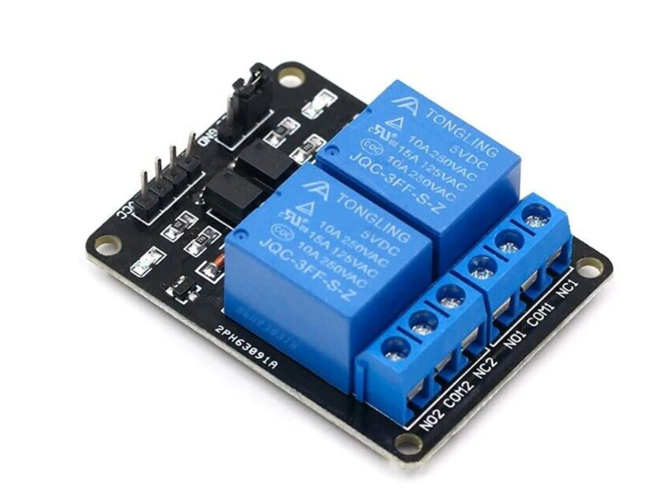

# IoT Home Automation Project

This project implements a home automation system using ESP32 microcontroller, a 5V relay module, an IR transmitter, and Amazon Alexa voice assistant. The system allows users to control various home appliances remotely via voice commands through the Amazon Alexa interface.

## Features

- **Voice Control**: Users can control home appliances using voice commands through Amazon Alexa.
- **Remote Access**: The system enables remote access to home appliances, allowing users to control them from anywhere with an internet connection.
- **Flexible Configuration**: The system can be easily configured to control multiple appliances and adapt to different home automation needs.
- **Scalable**: Additional features and devices can be integrated into the system to enhance functionality and scalability.

## Components Used

- **ESP32 Microcontroller**: Acts as the main controller for interfacing with sensors, relays, and handling communication with the Amazon Alexa service.
- **5V Relay Module**: Used to control the power supply to various home appliances.
- **IR Transmitter**: Enables communication with appliances that use infrared remote control.
- **Amazon Alexa**: Provides the voice interface for controlling home appliances.

## Circuit Diagram

## Demo

<video controls src="demo/video1.mp4" title="Title"></video>
