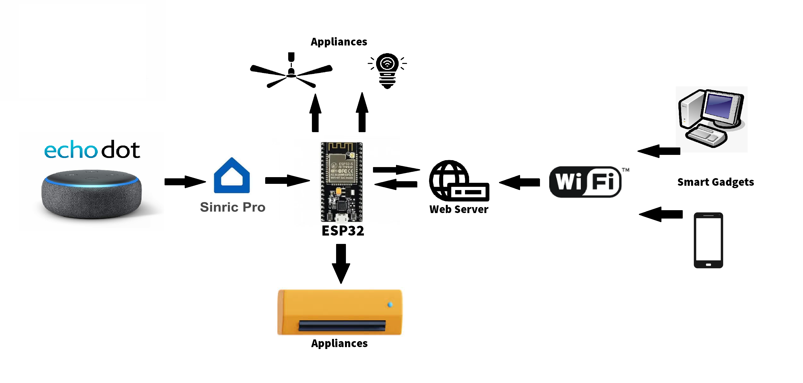
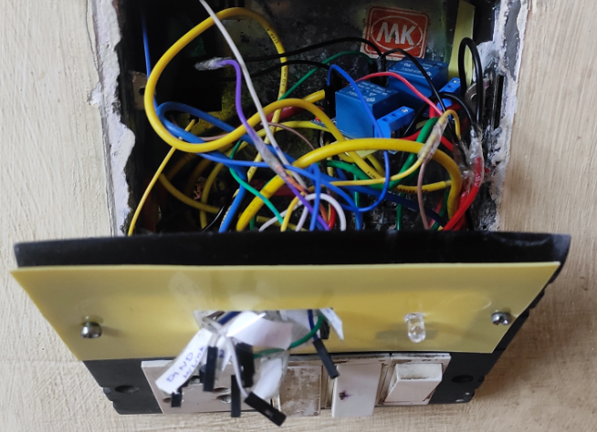
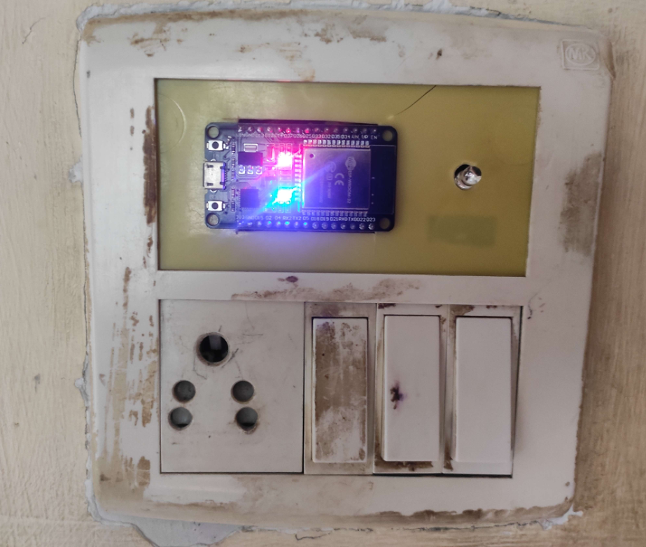
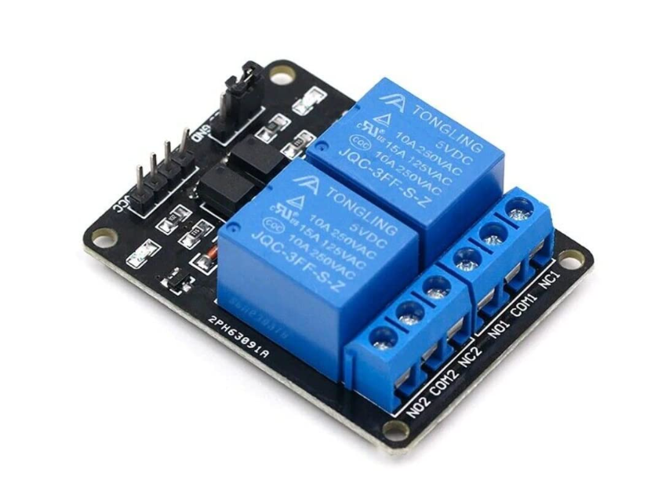

# IoT Home Automation Project

This project implements a home automation system using ESP32 microcontroller, a 5V relay module, an IR transmitter, and Amazon Alexa voice assistant. The system allows users to control various home appliances remotely via voice commands through the Amazon Alexa interface.

## Features

- **Voice Control**: Users can control home appliances using voice commands through Amazon Alexa.
- **Remote Access**: The system enables remote access to home appliances, allowing users to control them from anywhere with an internet connection.
- **Wi-Fi OTA Updates**: After the first USB flash, firmware can be uploaded over the local network.
- **Flexible Configuration**: The system can be easily configured to control multiple appliances and adapt to different home automation needs.
- **Scalable**: Additional features and devices can be integrated into the system to enhance functionality and scalability.

## Components Used

- **ESP32 Microcontroller**: Acts as the main controller for interfacing with sensors, relays, and handling communication with the Amazon Alexa service.
- **5V Relay Module**: Used to control the power supply to various home appliances.
- **IR Transmitter**: Enables communication with appliances that use infrared remote control.
- **Amazon Alexa**: Provides the voice interface for controlling home appliances.

## OTA firmware updates

Flash the firmware over USB once to install OTA support. After the ESP32
connects to Wi-Fi, upload future builds over the same local network:

```sh
pio run -e nodemcu-32s-ota -t upload
```

The default address is `home-automation.local`. If mDNS is unavailable, pass
the device IP explicitly:

```sh
pio run -e nodemcu-32s-ota -t upload --upload-port 192.168.1.100
```

Set `APP_OTA_PASSWORD` as a build flag to require an OTA password, and pass the
same password to PlatformIO with `--upload-port`/`--upload-flag` configuration.

## Circuit Diagram



## Demo







https://github.com/user-attachments/assets/ce81b5e0-ad6f-4273-9d8d-6daa331f1479
